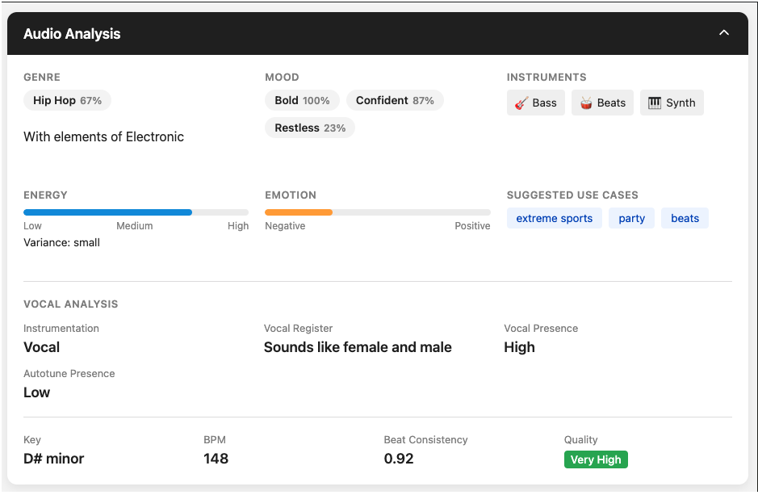

# Audio Analysis Project



This project provides audio analysis capabilities using Essentia and TensorFlow models for genre and mood classification. It's designed to analyze audio files and extract high-level features such as music genre and emotional mood.

## Features

- Audio genre classification using Discogs-trained models
- Mood detection (aggressive, relaxed, happy, sad, party, emotional)
- High-level feature extraction
- Support for various audio formats
- Automatic resampling to required sample rates
- Robust error handling and logging
- Genre Detection
- Mood Detection
- Instrument Recognition
- Emotion Estimation
- Vocal Register Estimation
- Vocal Presence Detection
- Autotune Presence Estimation
- Key Detection
- Beat Consistency Score
- Audio Quality Estimation

## Prerequisites

- Docker
- Python 3.7+ (for local development)
- TensorFlow 2.x
- Essentia
- NumPy

## Quick Start with Docker

The easiest way to run the audio analysis is using Docker. Follow these steps:

1. Build the Docker image:
```bash
docker build -t track-audio-analysis:local .
```

2. Run the container with your audio files:
```bash
docker run -v /path/to/local/audio/files:/opt/ml/processing/input/data \
    -v /path/to/local/output:/opt/ml/processing/output/analysis \
    track-audio-analysis:local \
    --s3-input-uri /opt/ml/processing/input/data \
    --s3-output-uri /opt/ml/processing/output/analysis \
    --use-essentia true
```

Replace `/path/to/local/audio/files` with the path to your audio files directory and `/path/to/local/output` with where you want the analysis results to be saved.

## Project Structure

- `Dockerfile` - Container configuration for local and cloud deployment
- `requirements.txt` - Python dependencies
- `src/` - Source code directory
- `input/` - Input directory for audio files
- `output/` - Output directory for analysis results

### AWS-specific Files (Not needed for local use)
- `deploy.sh` - Script for deploying to AWS SageMaker
- `buildspec.yml` - Configuration for AWS CodeBuild

## Required Models

The project requires the following TensorFlow models (`.pb` files):

1. Feature Extractor Model:
   - `discogs-effnet-bs64-1.pb`

2. Genre Classification Model:
   - A model file containing 'genre_discogs' in its name

3. Mood Classification Model:
   - A model file containing 'mood_' in its name

Place these models in the appropriate directory inside the Docker container or mount them as a volume.

## Usage

### Using Docker (Recommended)

1. Place your audio files in a local directory
2. Run the Docker container as shown in the Quick Start section
3. Find the analysis results in your specified output directory

### Using Python Directly

```python
from src.models.essentia_models import EssentiaModels

# Initialize the analyzer
analyzer = EssentiaModels()

# Load the models
analyzer.load_models()

# Analyze an audio file
import numpy as np
import librosa

# Load audio file
audio_signal, sample_rate = librosa.load('path/to/your/audio/file.mp3', sr=None)

# Analyze the audio
results = analyzer.analyze_audio(audio_signal, sample_rate)

# Print results
print("Genre:", results.get('genre', {}).get('value'))
print("Genre Confidence:", results.get('genre', {}).get('confidence'))
print("Mood:", results.get('mood', {}).get('value'))
print("Mood Confidence:", results.get('mood', {}).get('confidence'))
```

## Model Details

### Genre Classification
The genre model supports the following genres:
- Blues
- Classical
- Country
- Disco
- Hip-hop
- Jazz
- Metal
- Pop
- Reggae
- Rock
- Electronic
- Folk
- Soul
- Funk
- Alternative
- Indie
- Ambient
- Experimental

### Mood Classification
The mood model detects the following moods:
- Aggressive
- Relaxed
- Happy
- Sad
- Party
- Emotional

## Error Handling

The system includes comprehensive error handling and logging. All operations are logged with appropriate detail levels. Common error scenarios include:

- Missing model files
- Invalid audio input
- Model loading failures
- Feature extraction errors

## Contributing

Contributions are welcome! Please feel free to submit a Pull Request.

## License

[Add your license information here]

## Acknowledgments

- Essentia for audio analysis capabilities
- TensorFlow for model support
- Discogs for genre classification training data 